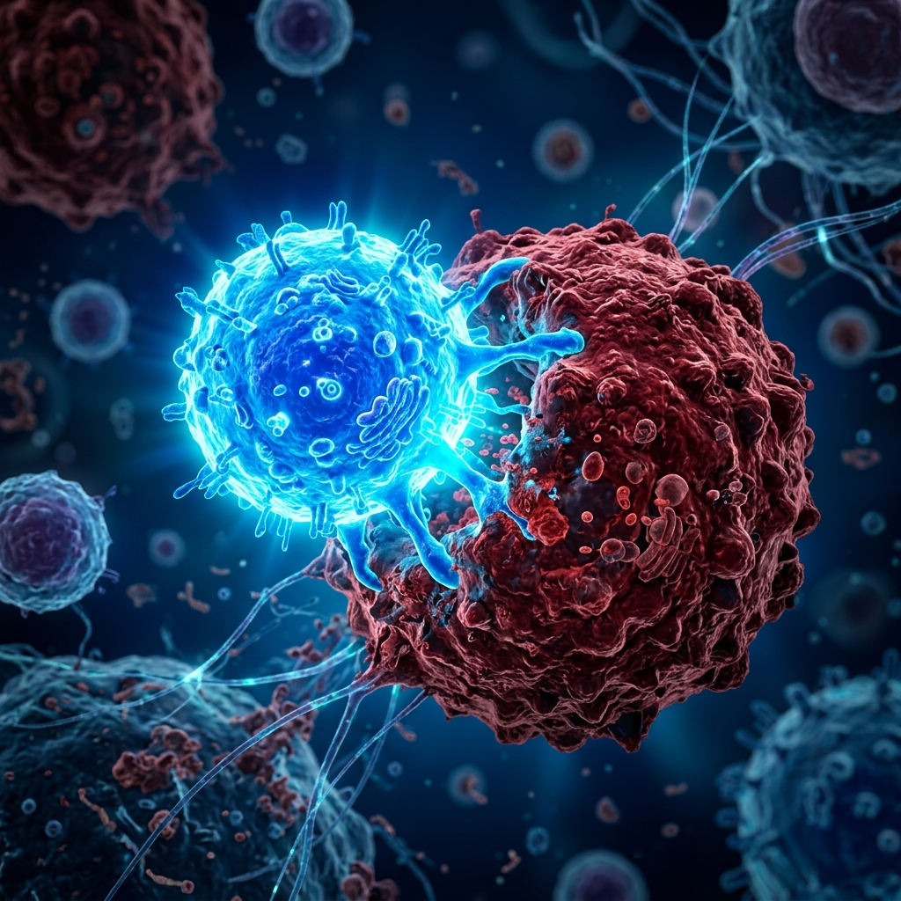

<<<<<<< HEAD
# canfinis
website
=======
# CanFinis Therapeutics — Website

Premium biotech-themed website for **CanFinis Therapeutics**, an oncology research and cell therapy startup based in Kolkata, India. The company develops tumor microenvironment platforms and next-generation CAR-T therapies for solid tumors, targeting India and Southeast Asia markets.



## Tech Stack

- **Framework**: React 19 with Vite 8
- **Routing**: React Router DOM v7
- **Animations**: Framer Motion + custom Canvas components
- **Icons**: Lucide React
- **Styling**: Vanilla CSS with CSS Custom Properties
- **Linting**: Oxlint

## Features

- **9 responsive pages** — Home, About, Science, CAR-T Technology, Pipeline, Services, Events, Careers, Contact
- **Canvas animations** — ColorWave, CellAnimation, FloatingParticles, DnaHelix, WaveAnimation
- **Scroll-triggered reveals** — CSS staggered animations with opacity + translateY transitions
- **Animated counters** — IntersectionObserver-powered stat counters
- **Mobile-first responsive** — Desktop, tablet, and mobile layouts with hamburger menu
- **SEO optimized** — Meta tags, Open Graph, semantic HTML
- **Fixed navbar** — Transparent-to-solid on scroll

## Pages

| Route | Page |
|-------|------|
| `/` | Home |
| `/about` | About Us |
| `/science` | Science |
| `/cart-technology` | CAR-T Technology |
| `/pipeline` | Pipeline |
| `/services` | Services |
| `/events` | Events & News |
| `/careers` | Careers |
| `/contact` | Contact |

## Project Structure

```
canfiis/
├── public/                 # Static assets (images, SVGs)
│   ├── hero_cells.png
│   ├── founder-amjad.jpg
│   ├── founder-chandra.jpg
│   ├── founder-pradip.jpg
│   ├── event-*.jpg
│   └── ...
├── src/
│   ├── components/         # Reusable components
│   │   ├── Navbar.jsx
│   │   ├── Footer.jsx
│   │   ├── CountUp.jsx
│   │   ├── CellAnimation.jsx
│   │   ├── ColorWave.jsx
│   │   ├── DnaHelix.jsx
│   │   ├── FloatingParticles.jsx
│   │   └── WaveAnimation.jsx
│   ├── pages/              # Route pages
│   │   ├── Home.jsx
│   │   ├── About.jsx
│   │   ├── Science.jsx
│   │   ├── CARTTech.jsx
│   │   ├── Pipeline.jsx
│   │   ├── Services.jsx
│   │   ├── Events.jsx
│   │   ├── Careers.jsx
│   │   └── Contact.jsx
│   ├── utils/              # Utility functions
│   ├── App.jsx             # Router + layout
│   ├── main.jsx            # Entry point
│   └── index.css           # Design tokens + global styles
├── index.html
├── package.json
└── vite.config.js
```

## Getting Started

### Prerequisites

- Node.js 18+
- npm or yarn

### Install

```bash
npm install
```

### Development

```bash
npm run dev
```

Opens at [http://localhost:5173](http://localhost:5173)

### Build

```bash
npm run build
```

Output in `dist/`

### Preview

```bash
npm run preview
```

### Lint

```bash
npm run lint
```

## Design System

### Color Palette

| Token | Hex | Usage |
|-------|-----|-------|
| Primary (Navy) | `#003d5b` | Navbar, headings, CTAs |
| Primary Light | `#005a80` | Hover states, gradients |
| Teal | `#00a8cc` | Accent, links, tags |
| Teal Light | `#e6f7fb` | Tag backgrounds, light sections |
| Dark BG | `#0d1e2e` | Feature cards, dark sections |
| Stats Gradient | `#003d5b → #005a80 → #006d96` | Stats banner |

### Typography

- **Body**: Inter (300–900)
- **Display/Headings**: Poppins (300–900)
- **CSS Variables**: `--font`, `--font-display`

### Spacing

- Container max-width: `1320px`
- Section padding: `64px` (desktop), `48px` (mobile)
- Border radius: `12px` (cards), `20px` (large)

## Animation Components

| Component | Description |
|-----------|-------------|
| `ColorWave` | Canvas-based sine wave with brand colors |
| `CellAnimation` | Floating cell/molecule particles on Canvas |
| `FloatingParticles` | Floating dots/particles overlay |
| `DnaHelix` | DNA helix animation |
| `WaveAnimation` | SVG wave dividers |
| `CountUp` | Animated number counters with IntersectionObserver |

## Content Source

All company data, pipeline details, team information, and events sourced from [canfinis.com](https://canfinis.com/).

## Contact

- Email: contact@canfinis.com
- Phone: +91 8861410623
>>>>>>> fb8d30d (Initial commit: CanFinis Therapeutics website)
